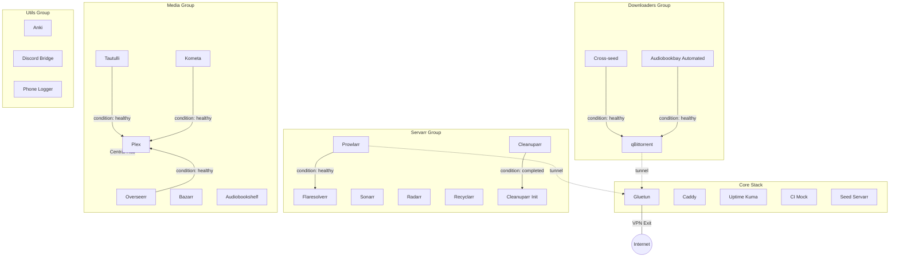

# Deployment architecture

A walkthrough of how a `make deploy` (or equivalent `ansible-playbook
site.yml`) actually unfolds, and where to make changes.

## The layers, top down

```
site.yml                                  Playbook entry point — orders the roles
└── roles/
    ├── bootstrap/                        Host prereqs (docker, packages, user)
    ├── dev_env/                          User-level shell, dotfiles, CLI tools
    ├── mergerfs/                         Pool the disks (see decisions/0001)
    ├── cloudflared/                      Tunnel + wildcard DNS routing
    ├── host_cron/                        Host-level scripts + cron entries
    ├── backup/                           Nightly restic backup of /home/caleb/config (decisions/0009)
    ├── service_manager/                  Where every container is provisioned
    │   ├── tasks/main.yml                The high-level deploy loop
    │   ├── tasks/per_service/<name>.yml  Per-service pre-deploy steps
    │   ├── tasks/api_wiring.yml          Post-deploy API + SQL provisioning
    │   ├── tasks/audiobookshelf_post.yml Post-deploy audiobookshelf provisioning
    │   └── templates/                    Shared config templates (qBittorrent.conf, plex_preferences.xml, etc.)
    ├── notes/                            Static notes site (note.caleb.trade)
    └── verify/                           Post-deploy assertions
└── services/<name>/docker-compose.yml.j2 The compose template per service
└── inventory/group_vars/all/main.yml     The single source of truth for service names, images, ports
└── inventory/group_vars/all/secrets.sops.yml  SOPS-encrypted secrets, decrypted at run time
```

Run `site.yml` and the roles fire in this order. `service_manager` is by far
the heaviest — read its `tasks/main.yml` end-to-end at least once before
touching it.

## What `service_manager` does, in order

1. **Ensure the shared docker network exists** (`docker_network`).
2. **Set API key facts** for the *arr stack from secrets.
3. **Create per-service appdata directories** under `{{ config_root }}` with
   `puid:pgid` ownership.
4. **Run per-service pre-deploy tasks** (`per_service/<name>.yml`) — one
   include per service. Most are stubs; the heavy ones are
   `qbittorrent.yml` (config seeding), `caddy.yml`, `plex.yml`, and
   `cleanuparr.yml` (SQL script deployment).
5. **Seed admin users into the *arr SQLite DBs** (sonarr, radarr, prowlarr).
   This is the bootstrap that makes the API reachable for step 9.
6. **Render `docker-compose.yml`** for every service from
   `services/<name>/docker-compose.yml.j2`.
7. **Reclaim container names held by unmanaged containers** — see
   `decisions/0003-name-reclaim-step.md`. Do not delete this step.
8. **Deploy core stack first** (includes `gluetun` and `ci-mock`).
9. **Wait for `gluetun` to be healthy**. This ensures services routing
   through the VPN have a working gateway immediately.
10. **Deploy remaining service groups** (`servarr`, `downloaders`, `media`,
    `utils`). High-priority dependencies (like `cleanuparr-init`) run
    automatically via `depends_on`.
11. **API wiring** (`tasks/api_wiring.yml`) — wires Sonarr/Radarr to
    Prowlarr, sets root folders, and configures download clients.
12. **Audiobookshelf post-deploy** (`tasks/audiobookshelf_post.yml`).

## Service Dependency Graph

This map shows the explicit and implicit (network-mode) interconnections that
determine the homelab's boot order and failure domains.



## Where to make a change

| Change you want to make | File to edit |
| --- | --- |
| Add a new service | `inventory/group_vars/all/main.yml` (add to `services:` list) + `services/<name>/docker-compose.yml.j2` + `roles/service_manager/tasks/per_service/<name>.yml` (can be a stub) |
| Pin or bump an image tag | `inventory/group_vars/all/main.yml` |
| Change a port, expose publicly, or move behind the VPN | `inventory/group_vars/all/main.yml` (`port`, `public`, `subdomain`, `use_vpn`) |
| Tune a service's runtime config | The shared templates in `roles/service_manager/templates/` (e.g. `qBittorrent.conf.j2`, `plex_preferences.xml.j2`, `kometa_config.yml.j2`, `overseerr_settings.json.j2`) |
| Change pre-deploy provisioning for one service | `roles/service_manager/tasks/per_service/<name>.yml` |
| Change post-deploy API/SQL wiring | `roles/service_manager/tasks/api_wiring.yml` |
| Add a public subdomain | `inventory/group_vars/all/main.yml` (`subdomain` + `public: true`); the zone's wildcard CNAME handles DNS — see `decisions/0004-cloudflared-wildcard-dns.md` |
| Add a host-level cron job | `inventory/group_vars/all/main.yml` (`host_cron_jobs:`) + script in `roles/host_cron/files/` |

## Conventions worth knowing

- **Service identity is keyed by `name`.** Compose project name, container
  name, service_manager loop variable, appdata directory under
  `{{ config_root }}`, internal DNS name on `{{ docker_network }}` — all
  match `services[*].name`.
- **`puid` / `pgid` are global** (`inventory/group_vars/all/main.yml`).
  LinuxServer.io images consume these to drop privileges; non-LSIO images
  may not — check the upstream docs (`docs/sources.md`) for each.
- **Hardlinks / atomic moves rely on a shared parent bind mount.** See
  `decisions/0002-shared-parent-bind-mount.md`. If you give a service its
  own bind for `/torrents` and a separate one for `/media`, hardlinks
  break with `EXDEV`.
- **`:latest` is the default; pin when schema or layout breakage matters.**
  Currently pinned: `cleanuparr` (DB schema coupling — see decision 0005),
  `anki` (volume path changes between major tags), `mergerfs` (host-level,
  in `mergerfs_version`).
- **Locally-built services** carry `build_local: true` instead of a digest
  pin. Source lives in a separate public repo (`source_repo`) and is
  cloned + built on the host at deploy time. Currently: `phone-logger`.
  See `decisions/0010-locally-built-services.md`.
- **Secrets live in `inventory/group_vars/all/secrets.sops.yml`.** Decrypt
  with `sops` before reading; never paste secret content into other files.
